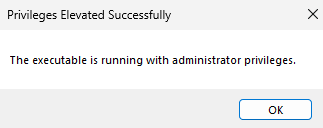

# Docker Setup

## Installation

=== "macOS"

    ```bash
    brew install --cask docker
    ```

    Or download from [docker.com](https://www.docker.com/products/docker-desktop)

=== "Linux"

    ```bash
    curl -fsSL https://get.docker.com | sh
    sudo usermod -aG docker $USER
    # logout and login
    ```

=== "Windows"

    ```powershell
    # winget
    winget install Docker.DockerDesktop

    # scoop
    scoop install docker
    ```

    Or download from [docker.com](https://www.docker.com/products/docker-desktop)

---

## Running Docker in VDI Environment

In corporate VDI (Virtual Desktop Infrastructure) environments, Docker Desktop may require elevated privileges to run properly.

### Step 1: Right-click Docker Desktop

Right-click the Docker Desktop shortcut and select **Run with Administrator Privileges**.


### Step 2: Provide Elevation Reason

A Privilege Elevation dialog will appear. Enter a reason (e.g., "Development work") and click **Continue**.


### Step 3: Confirmation

You'll see a confirmation that Docker is now running with administrator privileges.



> **_TIP:_** If Docker fails to start containers or shows permission errors, running with elevated privileges usually resolves these issues in VDI environments.

---

## Login to Azure Container Registry

Before pulling images from Azure Container Registry (ACR), you need to authenticate with Azure first.

> **_WARNING:_** In VDI environments, run these commands in a **normal terminal** (not elevated). ACR login does not work in terminals started with administrator privileges.

### Step 1: Login to Azure

```bash
az login
```

Or use device code for remote/VDI sessions:

```bash
az login --use-device-code
```

### Step 2: Select Subscription

List available subscriptions and select the correct one:

```bash
az account list -o table
az account set -s "<subscription-name-or-id>"
```

### Step 3: Login to ACR

```bash
az acr login -n <acr-name>
```

### Step 4: Docker Login

```bash
docker login <acr-name>.azurecr.io
```

> **_NOTE:_** ACR login tokens are valid for 3 hours. Re-run `az acr login` and `docker login` if you get authentication errors.

### Troubleshooting: Docker Login Still Fails

If docker login still doesn't work, edit the Docker config file:

- **Windows:** `%USERPROFILE%\.docker\config.json`
- **macOS/Linux:** `~/.docker/config.json`

Change `credsStore` from:

```json
"credsStore": "wincred",
```

To:

```json
"credsStore": "",
```

Then retry the docker login command.

---

## Custom Install Path (Windows)

Don't double-click the installer. Use command line to specify custom paths.

=== "PowerShell"

    ```powershell
    # Run as Administrator
    cd ~\Downloads
    Start-Process -Wait -FilePath ".\Docker Desktop Installer.exe" -ArgumentList "install", "-accept-license", "--installation-dir=D:\Docker", "--wsl-default-data-root=D:\Docker\images"
    ```

=== "CMD"

    ```cmd
    :: Run as Administrator
    cd %USERPROFILE%\Downloads
    start /w "" "Docker Desktop Installer.exe" install -accept-license --installation-dir=D:\Docker --wsl-default-data-root=D:\Docker\images
    ```

**Flags explained:**

| Flag | Purpose |
|------|---------|
| `-accept-license` | Auto-accept license agreement |
| `--installation-dir=D:\Docker` | Install Docker app to D:\Docker |
| `--wsl-default-data-root=D:\Docker\images` | Store WSL data & images on D: |

> **_NOTE:_** Without `--wsl-default-data-root`, images still go to `%HOME%\AppData\Local\Docker`

---

## Custom Data Path (Post-Install)

=== "macOS"

    Docker Desktop → Settings → Resources → Disk image location

=== "Linux"

    Edit `/etc/docker/daemon.json`:

    ```json
    {
      "data-root": "/path/to/docker"
    }
    ```

    ```bash
    sudo systemctl restart docker
    ```

=== "Windows"

    Docker Desktop → Settings → Resources → Disk image location

---

## Common Commands

```bash
docker ps                     # running containers
docker ps -a                  # all containers
docker images                 # list images
docker system prune -a        # cleanup
```

---

## Compose

```bash
docker compose up -d
docker compose down
docker compose logs -f
```
